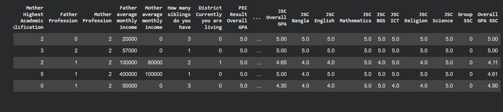
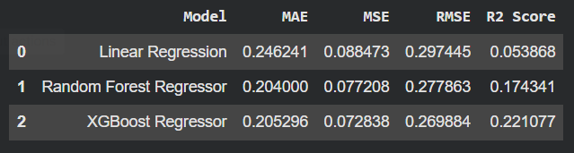
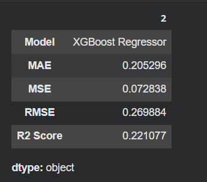

# Regression Models Comparison

This project compares three regression models — **Linear Regression**, **Random Forest Regressor**, and **XGBoost Regressor** — applied to a tabular dataset.  
Each model is evaluated using standard error metrics to determine which algorithm delivers the best predictive performance.

---

## 📁 Dataset
The dataset used for this project was loaded from Google Drive in `.xlsx` format.

Example path used in Google Colab:/content/drive/MyDrive/Group_prediction_by_Regressor-Dataset_(2).xlsx

### 📊 Dataset Preview

Below is a screenshot showing the first few rows of the dataset used in this project:

### 📈 Model Comparison Table

The table below compares the performance of the three regression models based on MAE, MSE, RMSE, and R² Score:

### 🏆 Best Model Summary

The following screenshot shows the evaluation metrics for the XGBoost Regressor, which achieved the highest R² Score and lowest error values:

